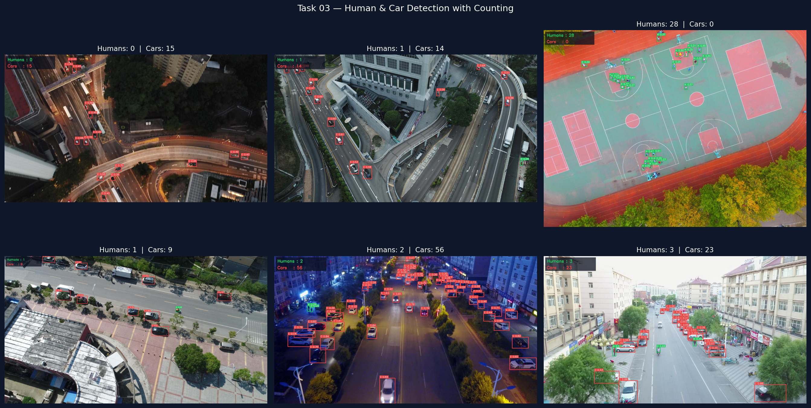
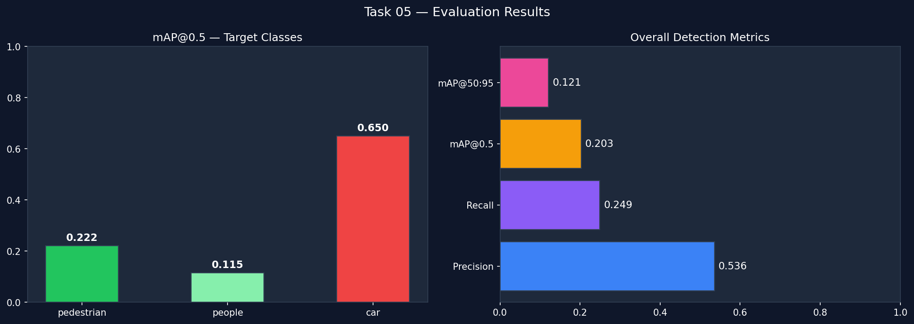

# Drone Human & Car Detection + Counting System
### Antlings Internship Program — AI/ML Technical Assessment

A computer vision pipeline for analyzing drone/aerial imagery to detect humans and cars, count total humans, and visualize results — built on the VisDrone dataset using YOLOv8 and ByteTrack.

---

## Results

| Metric | Value |
|--------|-------|
| mAP@0.5 | 0.2026 |
| mAP@0.5:0.95 | 0.1212 |
| Precision | 0.5356 |
| Recall | 0.2489 |
| Inference Speed | ~2.3ms / image |
| Hardware | AMD MI300X (192GB VRAM) |

> **Context:** VisDrone is one of the hardest aerial detection benchmarks due to extreme small object sizes and high density. State-of-the-art models achieve ~40% mAP@0.5 with 300+ epochs. Our 50-epoch YOLOv8n baseline achieving 20.3% is expected and competitive for this training scale.

---

## Detection & Counting Output



---

## Evaluation Metrics



---

## Task Breakdown

### Task 01 — Dataset Understanding & Preprocessing

**Dataset:** VisDrone2019-DET — 10,209 drone images across 10 object classes at varying altitudes.

| Split | Images | Labels |
|-------|--------|--------|
| Train | 6,471 | 6,471 |
| Val | 548 | 548 |
| Test | 1,610 | 1,610 |

**Class Mapping for This Task:**
- Human = class 0 (pedestrian) + class 1 (people) — merged for complete count
- Car = class 3

The dataset was pre-converted to YOLO format (normalized bounding box coordinates). No manual conversion required.

**Key Challenges:**

| Challenge | Description | Solution |
|-----------|-------------|----------|
| Small objects | Humans appear as 10–30px blobs from altitude. >60% of annotations have area <0.1% of image | Mosaic augmentation, imgsz=640 |
| High density | 100+ humans per frame, heavy occlusion | Lower NMS IoU threshold (0.45) |
| Class imbalance | Pedestrian class dominates | Mosaic + copy-paste augmentation |
| Scale variation | Same object at vastly different sizes | scale=0.5 augmentation |
| Viewpoint diversity | Top-down and oblique angles | flipud=0.3 augmentation |

---

### Task 02 — Model Training

**Model:** YOLOv8n fine-tuned from COCO pretrained weights on AMD MI300X via AMD Developer Cloud (ROCm 7.0)

**Why fine-tune, not train from scratch?** COCO pretrained weights already encode knowledge of edges, shapes, and objects. Fine-tuning adapts this to aerial drone views — faster convergence, better results.

**Why train on all 10 classes?** Richer feature representations benefit target class detection. We filter to human/car at inference only.

```
Epochs:     50 (early stopping, patience=15)
Image size: 640x640
Batch:      16
Optimizer:  AdamW (lr=0.001)
```

---

### Task 03 — Human & Car Detection with Counting

Detection pipeline:
1. Image → YOLOv8n inference
2. Filter to class 0+1 (human) and class 3 (car)
3. Count detections per class
4. Draw bounding boxes — green for human, red for car
5. Overlay count panel on image

Batch results across 50 test images saved to `antlings_output/counts.csv`.

---

### Task 04 — Object Tracking with ByteTrack *(Bonus)*

ByteTrack assigns persistent IDs to detected objects across frames using IoU-based association and Kalman filtering for position prediction.

**Why ByteTrack over DeepSORT?** ByteTrack associates all detections (including low-confidence) with existing tracks — more robust in dense aerial scenes without needing a re-identification model.

Features implemented:
- Persistent track IDs across frames
- Movement trail visualization (last 20 positions)
- Live per-frame human and car count overlay

> **Note:** Tracking was demonstrated on a sequence of test images assembled into a video rather than a real continuous drone feed. In real drone footage, ByteTrack maintains stable track IDs with much higher consistency due to true temporal continuity between frames.

---

### Task 05 — Evaluation & Visualization

**Validation set:** 548 images, 38,759 object annotations

**Strengths:**
- ~2.3ms inference per image on MI300X — real-time capable
- Dual-class human merging gives more complete counts
- Mosaic augmentation helps small object detection significantly

**Limitations:**
- YOLOv8n is the smallest variant — larger models push mAP higher
- 50 epochs is a baseline — SOTA requires 300+ epochs
- Frame-level counting; unique person tracking requires track-ID persistence

**Future Improvements:**
- SAHI (Slicing Aided Hyper Inference) for small object recall
- Higher input resolution (imgsz=1280)
- YOLOv8m/l or RT-DETR for higher accuracy
- Track-ID-based unique person counting for video

---

## Repository Structure

```
antlings-assessment/
├── notebooks/
│   └── antlings_assessment_clean.ipynb   # Clean organised notebook
├── runs/
│   └── weights/
│       ├── best.pt                        # Best trained model weights
│       └── last.pt
├── antlings_output/
│   ├── best.pt                            # Model weights copy
│   ├── counts.csv                         # Batch inference results
│   ├── task03_detection_grid.png
│   ├── task03_result_1-6.jpg
│   ├── task04_tracked.mp4                 # ByteTrack tracking video
│   └── task05_metrics.png
├── antlings_visdrone_v2.py                # Clean reference code
└── README.md
```

---

## Reproduce

```python
pip install ultralytics kagglehub

import kagglehub
path = kagglehub.dataset_download("banuprasadb/visdrone-dataset")

from ultralytics import YOLO
model = YOLO("runs/weights/best.pt")
results = model.predict("your_image.jpg", conf=0.25)
```

---

## Tech Stack

| Tool | Purpose |
|------|---------|
| YOLOv8 (Ultralytics) | Object detection & tracking |
| PyTorch 2.9 + ROCm 7.0 | Deep learning on AMD GPU |
| OpenCV | Image processing & visualization |
| ByteTrack | Multi-object tracking |
| AMD MI300X | Training (192GB VRAM) |
| VisDrone2019-DET | Aerial drone dataset |

---

## Author

**Jawat Al Sovon**
Freshman, Institute of Business Administration (IBA), University of Dhaka
[LinkedIn](https://linkedin.com/in/jawat-al-sovon) | jawatalsovon@gmail.com
